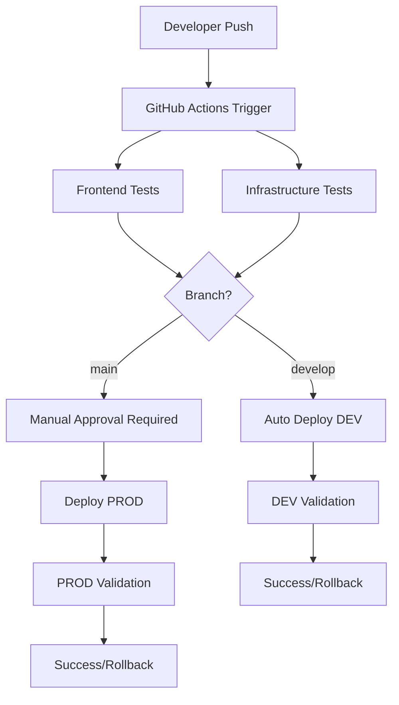

# CI/CD Pipeline Setup Guide

This document describes the comprehensive CI/CD pipeline setup for the VoisLab website, including automated testing, deployment, and rollback capabilities.

## Overview

The VoisLab website uses a multi-stage CI/CD pipeline with the following components:

- **GitHub Actions** for automation
- **AWS Amplify** for frontend hosting (with S3/CloudFront fallback)
- **AWS CDK** for Infrastructure as Code
- **Automated testing** at multiple levels
- **Manual approval gates** for production deployments
- **Rollback capabilities** for failed deployments

## Pipeline Architecture



## Workflows

### 1. Main CI/CD Pipeline (`ci.yml`)

**Triggers:**
- Push to `main` or `develop` branches
- Pull requests to `main`
- Manual workflow dispatch

**Jobs:**
- `test-frontend`: Linting, type checking, building
- `test-infrastructure`: CDK tests and synthesis
- `deploy-dev`: Automatic deployment to development (develop branch)
- `deploy-prod`: Manual approval deployment to production (main branch)
- `rollback-prod`: Automatic rollback on production failures

### 2. Infrastructure Deployment (`infrastructure.yml`)

**Triggers:**
- Manual workflow dispatch only

**Capabilities:**
- Deploy/destroy infrastructure
- Environment separation (dev/prod)
- Pre-deployment validation
- Post-deployment testing
- Automatic rollback on failures

### 3. Production Deployment (`production-deploy.yml`)

**Triggers:**
- Manual workflow dispatch with confirmation

**Features:**
- Requires typing "CONFIRM" to proceed
- Comprehensive pre-deployment checks
- Backup creation before deployment
- Health checks after deployment
- Automatic cleanup of old backups

### 4. Infrastructure Testing (`infrastructure-test.yml`)

**Triggers:**
- Manual workflow dispatch

**Test Types:**
- Comprehensive: All tests
- Security: Security-focused validation
- Performance: Performance benchmarks
- Integration: End-to-end testing

### 5. UAT Pipeline (`uat-cicd.yml`)

**Triggers:**
- Manual workflow dispatch

**Scope Options:**
- Full: Complete UAT suite
- Frontend-only: Build and frontend tests
- Infrastructure-only: Infrastructure validation
- Deployment-only: Deployment process testing

## Environment Setup

### Development Environment

- **Branch:** `develop`
- **Deployment:** Automatic on push
- **Domain:** Amplify default domain or CloudFront
- **AWS Account:** Development account

### Production Environment

- **Branch:** `main`
- **Deployment:** Manual approval required
- **Domain:** Custom domain (voislab.com)
- **AWS Account:** Production account

## Required Secrets

Configure these secrets in your GitHub repository:

### Development Environment
```
AWS_ACCESS_KEY_ID_DEV
AWS_SECRET_ACCESS_KEY_DEV
AWS_REGION
```

### Production Environment
```
AWS_ACCESS_KEY_ID_PROD
AWS_SECRET_ACCESS_KEY_PROD
AWS_REGION
```

### Optional (for Amplify integration)
```
GITHUB_ACCESS_TOKEN
```

## Deployment Types

### Amplify Deployment

When GitHub repository and access token are configured:
- Automatic builds on code changes
- Branch-based deployments
- Custom domain support
- Built-in CDN and SSL

### S3 + CloudFront Deployment (Fallback)

When Amplify is not configured:
- Manual S3 sync in CI/CD
- CloudFront for CDN
- Manual SSL certificate management

## Usage Guide

### 1. Development Workflow

```bash
# Make changes
git checkout develop
# ... make changes ...

# Run local UAT (optional)
./scripts/run-uat.sh -e dev -s frontend-only

# Commit and push
git add .
git commit -m "Your changes"
git push origin develop

# Automatic deployment to DEV environment
```

### 2. Production Deployment

```bash
# Create pull request from develop to main
gh pr create --title "Release v1.0.0" --body "Production release"

# After review and merge to main
# Go to GitHub Actions and run "Production Deployment" workflow
# Type "CONFIRM" when prompted
```

### 3. Infrastructure Updates

```bash
# For infrastructure changes
# Go to GitHub Actions and run "Infrastructure Deployment" workflow
# Select environment and action (deploy/destroy/diff)
```

### 4. Running UAT Tests

```bash
# Local UAT
./scripts/run-uat.sh -e dev -s full

# GitHub Actions UAT
# Go to Actions > "UAT - CI/CD Pipeline Testing"
# Select scope and environment
```

## Monitoring and Validation

### Automatic Validation

Each deployment includes:
- Build artifact validation
- Infrastructure health checks
- Website accessibility tests
- Lambda function testing
- S3 bucket validation
- DynamoDB table checks

### Manual Validation

Use the validation script:
```bash
./scripts/validate-deployment.sh -e dev -v
```

## Rollback Procedures

### Automatic Rollback

- Triggered on deployment failures
- CloudFormation stack rollback
- Amplify deployment rollback (if applicable)

### Manual Rollback

1. **Infrastructure Rollback:**
   ```bash
   # Via GitHub Actions
   # Run "Infrastructure Deployment" workflow
   # Use previous stack template
   ```

2. **Frontend Rollback:**
   ```bash
   # For S3 deployment
   aws s3 sync s3://backup-bucket/ s3://website-bucket/
   
   # For Amplify
   # Use Amplify console to revert to previous deployment
   ```

## Troubleshooting

### Common Issues

1. **Build Failures:**
   - Check linting errors: `npm run lint`
   - Check type errors: `npm run type-check`
   - Check build process: `npm run build`

2. **Deployment Failures:**
   - Check AWS credentials
   - Verify stack status in CloudFormation console
   - Check deployment logs in GitHub Actions

3. **Infrastructure Issues:**
   - Run infrastructure tests: `npm test` (in infrastructure/)
   - Check CDK synthesis: `npm run synth`
   - Validate deployment: `./scripts/validate-deployment.sh`

### Debug Commands

```bash
# Check AWS connectivity
aws sts get-caller-identity

# Validate CDK
cd infrastructure && npm run synth

# Test frontend build
npm run build

# Run local UAT
./scripts/run-uat.sh -v
```

## Security Considerations

### Secrets Management
- Use GitHub Secrets for AWS credentials
- Separate credentials for dev/prod environments
- Rotate credentials regularly

### Access Control
- Branch protection rules on `main`
- Required reviews for production deployments
- Manual approval gates for sensitive operations

### Infrastructure Security
- S3 buckets with public access blocked
- IAM roles with least privilege
- CloudFront for secure content delivery

## Performance Optimization

### Build Optimization
- Dependency caching in GitHub Actions
- Artifact reuse between jobs
- Parallel job execution

### Deployment Optimization
- CloudFront caching
- S3 Transfer Acceleration
- Amplify global CDN

## Maintenance

### Regular Tasks
- Update dependencies monthly
- Review and rotate AWS credentials quarterly
- Clean up old deployment artifacts
- Monitor build performance metrics

### Monitoring
- GitHub Actions workflow success rates
- Deployment duration metrics
- Website performance monitoring
- AWS cost monitoring

## Support

For issues with the CI/CD pipeline:

1. Check the troubleshooting section above
2. Review GitHub Actions logs
3. Validate AWS resources using provided scripts
4. Check AWS CloudFormation console for stack status

## References

- [GitHub Actions Documentation](https://docs.github.com/en/actions)
- [AWS Amplify Documentation](https://docs.aws.amazon.com/amplify/)
- [AWS CDK Documentation](https://docs.aws.amazon.com/cdk/)
- [VoisLab Website Architecture](./ARCHITECTURE.md)